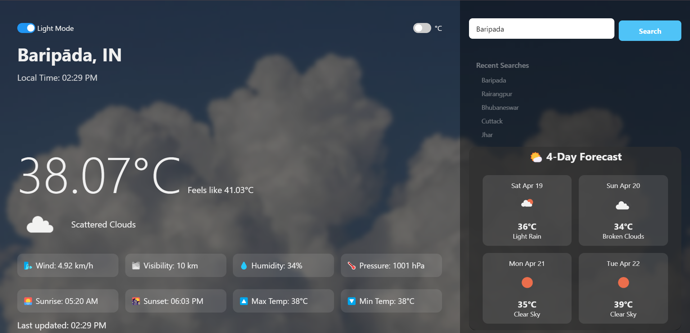
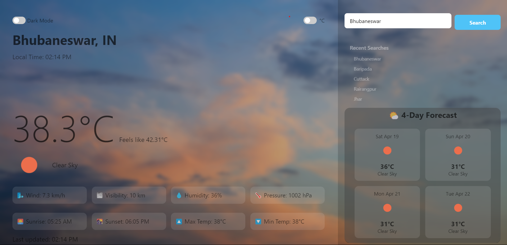

# 🌦️ Weather Mate

**Weather Mate** is a sleek and responsive weather web app that provides real-time weather updates, 4-day forecast, and detailed weather insights — all with a stylish modern UI. Built using **HTML**, **CSS**, and **Vanilla JavaScript**, and powered by the **OpenWeather API**.




---

## ✨ Features

- 🔍 Search for any city worldwide  
- 📍 Auto-detect current location using Geolocation  
- 🌡️ Toggle between Celsius and Fahrenheit  
- 🌓 Light & Dark mode switch  
- 🌄 Sunrise and sunset time  
- 🕒 Live local time of the selected city  
- 🌦️ 4-day weather forecast  
- 💨 Humidity, pressure, wind speed, visibility  
- ⏳ Last updated timestamp  
- 📚 Recent search history  
- 🖼️ Dynamic background & weather icons  
- 📱 Fully responsive layout  

---

## 🖥️ Live Demo

🔗 [View Live Project](https://weathermate-gnwy.onrender.com/)  
_(replace this link with your deployed project URL)_

---

## 📁 Folder Structure

```
Weather-Mate/
├── index.html
├── style.css
├── script.js
├── assets/
│   ├── weather-dark.png
│   └── weather-light.png
├── README.md
```

---

## 🚀 Getting Started

### 1. Clone the Repo

```bash
git clone https://github.com/your-username/weather-mate.git
cd weather-mate
```

### 2. Open in Browser

Just open `index.html` in your browser to run it locally.

---

## 🔑 Setup OpenWeather API Key

1. Go to [OpenWeatherMap](https://openweathermap.org/api) and create a free account.  
2. Navigate to **API keys** section and generate your API key.  
3. In `script.js`, replace this line with your API key:

```js
const apiKey = "YOUR_API_KEY_HERE";
```

---

## 🌐 Tech Stack

- HTML5  
- CSS3 (Glassmorphism + Responsive Design)  
- JavaScript (Vanilla JS)  
- OpenWeather API  
- Geolocation API  

---

## 🔮 Upcoming Enhancements

- ⏱️ Hourly Forecast  
- 📲 Add to Home Screen (PWA Support)  
- 💾 Save Favorite Cities  
- 🗣️ Voice Search  
- 🔔 Weather Alerts  

---

## 🧑‍💻 Author

Made with ❤️ by **Jitesh Bhakat**  
🔗 [GitHub](https://github.com/Jitesh8260)

---

## 📄 License

Licensed under the [MIT License](LICENSE).

> 🧊 “Check the weather in style – with Weather Mate.”
